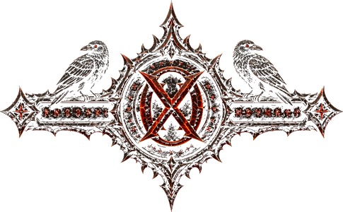

# Cryox Rahmentest

Öffne `frame-test.html` im Browser oder als lokale Browserquelle in OBS.

OBS:
- Breite: 1920
- Höhe: 1080
- FPS: 60

Das Emblem ist modular. Entferne diese Zeile, um es auszublenden:

```html

```

Oben und unten verwenden dieselbe Datei.
Links und rechts verwenden dieselbe Datei.
Alle vier Ecken verwenden dieselbe Datei und werden nur gespiegelt.
